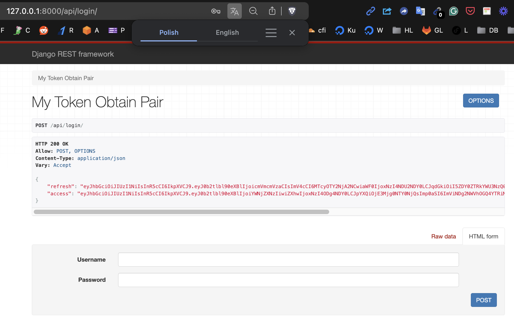

# Django Single Sign-On 🔐

Tired of juggling multiple logins for different services?  Let's ditch the password fatigue and embrace the power of **Single Sign-On (SSO)** with Django!

This project demonstrates how to implement seamless SSO integration with Django, simplifying user authentication across multiple microservices.  Think of it as your digital passport, granting you access to a whole world of applications with just one login.

## What is SSO?

SSO is like having a magic key that unlocks all your favorite apps.  Instead of remembering a different password for each service, you log in once and gain access to everything.  It's a win-win for both users and developers!

## How it Works

This project utilizes Django REST Framework (DRF) and SimpleJWT to create a secure and efficient SSO system.  Here's the gist:

1. **User Authentication:**  When a user logs in, they are authenticated using DRF and a JWT token is generated.
2. **Token Storage:**  The JWT token is stored securely on the client-side (e.g., in a cookie or local storage).
3. **Microservice Access:**  When the user attempts to access another microservice, the JWT token is sent along with the request.
4. **Token Validation:**  The microservice verifies the JWT token, ensuring the user is authenticated and authorized.

## Scenarios

SSO is a versatile solution that can be applied in various scenarios:

- **Microservice Architectures:**  Simplify user management across multiple services.
- **Enterprise Applications:**  Provide a unified login experience for employees.
- **Web Applications:**  Enhance user experience by eliminating the need for multiple logins.

## Getting Started

1. **Clone the repository:**
   ```bash
   git clone https://github.com/yourusername/django-sso-project.git
   cd django-sso-project
   ```

2. **Install dependencies:**
   ```bash
   pip install -r requirements.txt
   ```

3. **Create a .env file:**
   ```bash
   cp .env.example .env
   ```

4. **Set up the database:**
   ```bash
   python manage.py makemigrations
   python manage.py migrate
   ```

5. **Run the development server:**
   ```bash
   python manage.py runserver
   ```

## Let's Get Started!

Ready to unlock the power of SSO?  Dive into the code and explore the possibilities!  Feel free to ask questions and contribute to this project.  Let's make authentication a breeze! 💨


{ width="500" height="500" }
